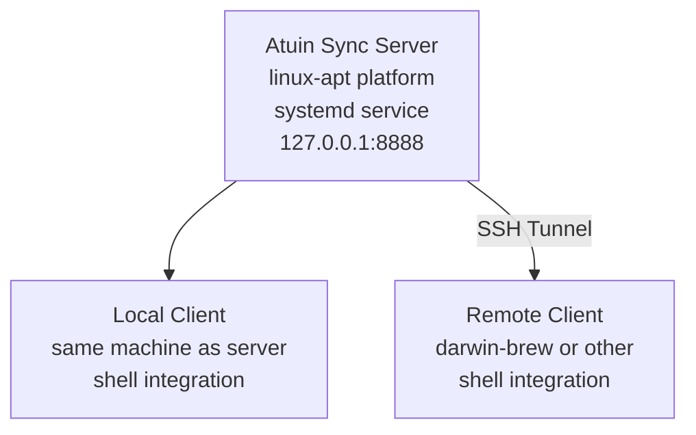

# Atuin Setup Guide

Atuin provides encrypted, synced shell history across all your machines.

## Architecture



**Key Points:**
- **Server**: linux-apt platform, runs via systemd user service
- **Clients**: Shell integration via `atuin init zsh` (no systemd needed)
- **Connection**: Remote clients use SSH tunnel to access server

## Server Setup

### 1. Apply Chezmoi Configuration

The server configuration is automatically set up on linux-apt platform:

```bash
chezmoi apply
```

This installs:
- `~/.config/atuin/server.toml` - Server configuration
- `~/.config/systemd/user/atuin-server.service` - Systemd service
- Enables and starts the service automatically

### 2. Verify Server is Running

```bash
systemctl --user status atuin-server.service
ss -tlnp | grep 8888  # Should show: 127.0.0.1:8888
```

### 3. Create User Account

```bash
atuin register -u <username> -e <email> -p <password>
atuin key  # Save this encryption key - needed on all clients
```

### 4. Disable Open Registration

```bash
chezmoi edit ~/.config/atuin/server.toml
# Change: open_registration = true → false
systemctl --user restart atuin-server.service
```

## Client Setup

### Remote Client (SSH Tunnel Required)

**1. Configure SSH Tunnel**

Add to SSH config:

```ssh
Host <server-host>
  LocalForward 8888 127.0.0.1:8888
```

Or manually: `ssh -L 8888:127.0.0.1:8888 <server-host>`

**2. Configure Client**

Create `~/.local/share/chezmoi/.env.work` (NOT tracked in git):

```bash
export ATUIN_SYNC_ADDRESS="http://127.0.0.1:8888"
export ATUIN_SYNC_KEY="<key-from-server>"
```

Reload: `cd ~/.local/share/chezmoi && direnv allow`

**3. Login and Sync**

```bash
atuin login -u <username> -p <password>
atuin import auto
atuin sync
```

### Local Client (Same Machine as Server)

**1. Configure Client**

Create `~/.local/share/chezmoi/.env.work`:

```bash
export ATUIN_SYNC_ADDRESS="http://127.0.0.1:8888"
export ATUIN_SYNC_KEY="<key-from-server>"
```

**2. Login and Sync**

```bash
atuin login -u <username> -p <password>
atuin import auto
atuin sync
```

## Shell Integration

Atuin is automatically integrated in zsh via `~/.config/zsh/atuin-config.zsh`:

**Features:**
- `Ctrl+R` - Search history (replaces default reverse search)
- `Up Arrow` - Context-aware history search (by prefix)
- Vi mode compatible bindings
- Automatic sync every 5 minutes

**The shell integration starts the client daemon automatically** - no systemd service needed for clients.

## Verification

### On Server

```bash
systemctl --user status atuin-server.service
ss -tlnp | grep 8888
journalctl --user -u atuin-server -f
```

### On Clients

```bash
atuin status
# Should show:
# - Synced: X records
# - Last sync: <recent timestamp>
# - Server: http://127.0.0.1:8888

# Press Ctrl+R in shell - should show synced history
```

### Test SSH Tunnel (Remote Clients)

```bash
lsof -i :8888  # Should show ssh process
curl http://127.0.0.1:8888  # Should return HTML page
```

## Troubleshooting

### Remote Client Can't Connect

**Symptom**: `atuin sync` fails with "connection refused"

**Solution**: Verify SSH tunnel
```bash
lsof -i :8888  # Check tunnel is established
ssh -L 8888:127.0.0.1:8888 <server-host>  # Manual tunnel
```

### Server Not Starting

**Symptom**: `systemctl --user status atuin-server` shows failed

**Solution**: Check logs
```bash
# View detailed logs
journalctl --user -u atuin-server -n 50

# Common issues:
# - Port already in use: Check with ss -tlnp | grep 8888
# - Database permissions: Check ~/.local/share/atuin/ ownership
# - Config syntax: Validate ~/.config/atuin/server.toml
```

### Sync Not Working

**Symptom**: `atuin sync` succeeds but history not syncing

**Solution**: Verify credentials
```bash
# Check environment variables are set
echo $ATUIN_SYNC_ADDRESS  # Should be http://127.0.0.1:8888
echo $ATUIN_SYNC_KEY      # Should be atuin_...

# Re-login if needed
atuin logout
atuin login -u <username> -p <password>
```

### Shell Integration Not Working

**Symptom**: Ctrl+R doesn't use atuin

**Solution**: Verify shell initialization
```bash
atuin status
exec zsh
bindkey | grep atuin
```

## Security Notes

- **Encryption**: History is encrypted with sync key before transmission
- **Key Management**: Store sync key in `.env.work` (not in git)
- **Network**: Server listens on localhost only (127.0.0.1)
- **SSH Tunnel**: Remote clients access server securely via SSH
- **Registration**: Disable `open_registration` after account creation

## Files and Locations

| File | Platform | Purpose |
|------|----------|---------|
| `~/.config/atuin/config.toml` | All | Client configuration |
| `~/.config/atuin/server.toml` | linux-apt | Server configuration |
| `~/.config/systemd/user/atuin-server.service` | linux-apt | Server systemd service |
| `~/.local/share/atuin/history.db` | All | Local history database |
| `~/.local/share/atuin/server.db` | linux-apt | Server sync database |
| `~/.local/share/atuin/key` | All | Encryption key (backup!) |
| `~/.local/share/chezmoi/.env.work` | All | Sync credentials (not in git) |

## References

- [Atuin Documentation](https://docs.atuin.sh/)
- [Self-Hosting Guide](https://docs.atuin.sh/self-hosting/server-setup/)
- [Configuration Reference](https://docs.atuin.sh/configuration/config/)
